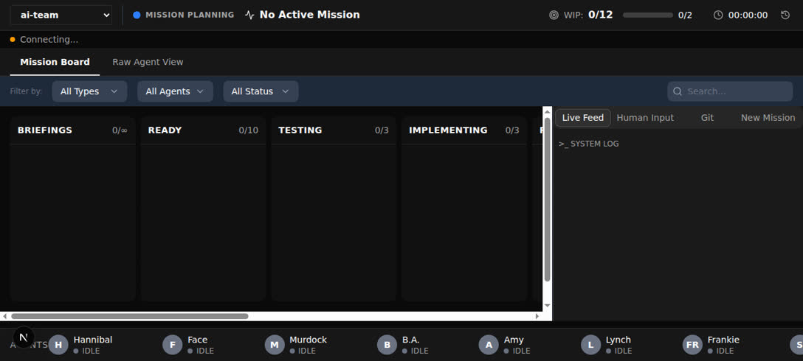
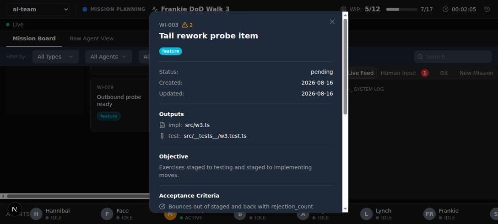
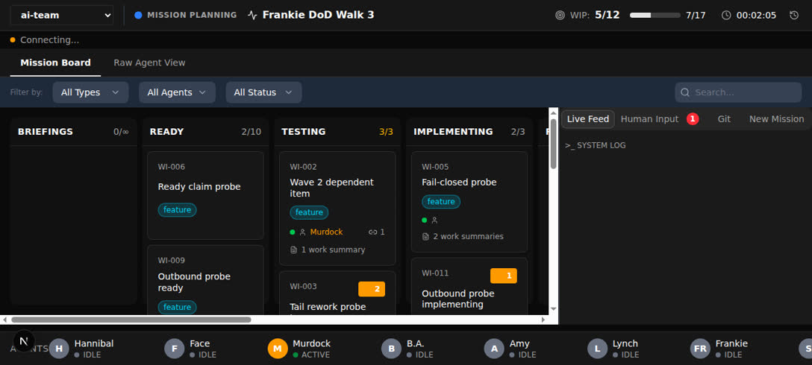
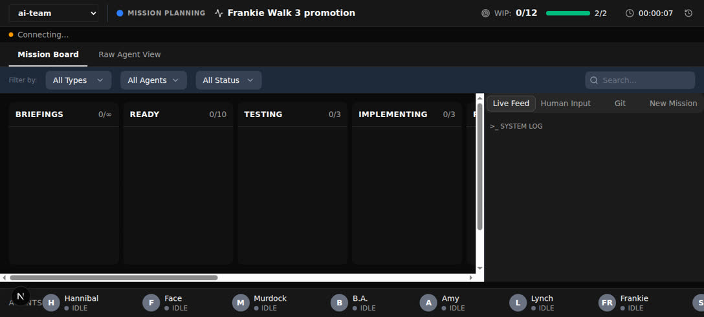

# Frankie — DoD Walk Evidence Bundle (WALK 3)

**Mission:** M-20260815-001 · **PRD:** `prd/ready/staged-stage.md`
**Walked:** 2026-08-16 (third walk) · **Result:** **6 / 6 PASS — no failures**

This is a **full re-walk** per ADR 0004, not a spot-check. Every one of the six
Definition of Done statements was re-driven from scratch against a freshly
wiped, migrated and re-seeded database. **No verdict was carried over from
either prior walk.**

**Why this walk happened.** Walk 1 returned 5/6 with one failure (DoD 2 — the
Stop-hook gate told the orchestrator to reopen a `done` item and wait for items
to come back to `done`, an unreachable state that deadlocks the tail). Walk 2
confirmed 6/6 after that fix. Stockwell's Final Mission Review then found the
full test suite RED: four stale pre-mission-contract test assertions across
WI-787 (2) and WI-789 (2), plus a missing regression pin folded into WI-791.
All were classified as test-coverage gaps rather than implementation bugs, and
were fixed off-board — the owning items are sealed in `done` with no legal
reopen path, so the fixes landed directly in the working tree. A change to test
assertions *should* leave app behaviour untouched; ADR 0004 requires that be
verified rather than assumed, so the whole DoD was walked again.

**Verdict on that question: app behaviour is unchanged.** All six statements
pass, and the two specifically flagged areas (WI-787's transition matrix,
WI-789's stop endpoint) were driven against the running app and match the
corrected assertions exactly — see the Targeted Re-Verification section.

**Environment:** local managed dev server (`devServer.managed: true`) —
`npm run dev:qa` on `http://localhost:5567`, which wipes, migrates and re-seeds
`qa.db` on every start. The standing container on `:5566` (prod-copy database)
was never touched. The live orchestration API (`kanban.theaiteam.dev`) has
**not** deployed this mission's code and was deliberately not used to judge
staged-stage behaviour.

Raw command/response evidence for every statement:
[`walk3-cli-transcript.md`](./walk3-cli-transcript.md).

---

## Checklist

| # | Definition of Done statement | Result |
|---|---|---|
| 1 | A mission whose items all reach `staged` triggers Frankie's walk without any item having entered `done`. | ✅ |
| 2 | A Frankie or Stockwell failure moves the named items `staged → testing\|implementing` through pipeline mechanics alone — zero manual board edits. | ✅ |
| 3 | `VERDICT: FINAL APPROVED` promotes every `staged` item to `done` atomically with the review write; a rejected or unparseable verdict promotes nothing. | ✅ |
| 4 | A wave-2 item becomes claimable as soon as its wave-1 dependency reaches `staged`, and `deps-check` and `agentStart` agree. | ✅ |
| 5 | `TRANSITION_MATRIX.done` is still `[]`. | ✅ |
| 6 | The board renders Staged between Probing and Done, and no `staged` item is silently rendered as Briefings. | ✅ |

**No failing work items. Nothing to bounce out of `staged`.**

---

### ✅ 1 — All-staged triggers the walk, nothing in `done`

`probing → done` is rejected by the API (`INVALID_TRANSITION`); `probing →
staged` succeeds. No item can reach `done` through the per-item pipeline at
all, so both the trigger condition and the "without any item having entered
`done`" clause hold by construction.

On a board of 2 staged items with `doneCount: 0`, `countBoard` reports
`{"totalActive":0,"doneCount":0,"stagedCount":2}` and the evidence gate fires
and demands the walk. With `stagedCount: 0` it stays silent. The companion gate
`checkStagedNotPromoted` independently refuses to let the mission stop while
anything sits in `staged`.

Board with both items in Staged and Done empty (`STAGED 2/∞`, `DONE 0/∞`,
`BRIEFINGS 0/∞`):



---

### ✅ 2 — Tail failure bounces through pipeline mechanics alone

**Two halves, both re-verified.**

**Half one — the mechanics.** Both rework routes are ordinary `ateam board-move
moveItem` calls — no `--force`, no direct database edit, no manual reopen — and
both are rejection-cap counted:

```
staged -> implementing   rejectionCount 0 -> 1
(back to staged)         rejectionCount 1      # forward re-entry does not increment
staged -> testing        rejectionCount 1 -> 2
```

The API records each bounce as a first-class `tail_rework` work-log entry
attributed to Hannibal — visible to an operator in the card modal, which is
what makes "through pipeline mechanics alone" observable from the front door
rather than only in the database:



Board end state — the bounced item sits in TESTING carrying its rejection badge
while Staged still holds the untouched items and Done is unaffected:



Claiming a `staged` item is refused (`INVALID_STAGE: Item cannot be claimed in
stage: staged`), which is exactly why no agent holds a claim at tail time and
why Hannibal executes the move directly rather than an agent rejecting it.

**Half two — the instruction text.** Both messages an orchestrator actually
reads at a tail failure were re-driven. Both prescribe the real transition and
a reachable restart condition:

- **Frankie-failure gate** (`checkFrankieEvidence`): "…**move it out of staged
  to testing or implementing using the earliest-flagged-stage rule (WI-794) — a
  real, rejection-cap-counted transition, not a manual reopen** (done is
  terminal, ADR 0005; items here are still in staged, never done). **Once the
  named items are reworked and back in staged**, dispatch Frankie to re-walk the
  FULL Definition of Done."
- **Stockwell-rejection gate** (`checkFinalReviewRejection`): the same corrected
  instruction, followed by "…the mission tail RESTARTS at Frankie (ADR 0004)."

**Neighbour checks (ADR 0004 — a fix for one statement can break its
neighbours):**

- No residual pre-`staged` phrasing survives anywhere in the enforcement layer
  or the docs: `grep` for `back in done` / `reopening a done item` /
  `reopen a done item` across `scripts/ agents/ playbooks/ commands/ docs/ adr/
  CLAUDE.md` returns **nothing**.
- The gate is still **live, not inert**: both consumers
  (`enforce-orchestrator-stop.js:113,158,172`, `enforce-final-review.js:98,125,142`)
  destructure `stagedCount` from `countBoard` and pass it into
  `checkFrankieEvidence` and `checkStagedNotPromoted`.
- The evidence-**staleness** gate — the mechanism that forced this very
  walk — still keys on `staged` transitions: a report older than the newest
  staged transition blocks as STALE with the full-re-walk instruction; a report
  newer than every staged transition allows.
- The suites guarding the changed file are green: `bun test
  scripts/hooks/__tests__/stop-gates.test.ts scripts/hooks/__tests__/stop-guards.test.ts`
  → **119 pass, 0 fail, 248 expect() calls**.

---

### ✅ 3 — `FINAL APPROVED` promotes atomically; nothing else promotes

Five verdict shapes driven through `writeFinalReview` against a staged board,
re-reading the board after each call:

| Verdict shape | promotedCount | Board after |
|---|---|---|
| `VERDICT: FINAL REJECTED` | 0 | unchanged, still staged |
| No verdict line at all | 0 | unchanged, still staged |
| Ambiguous prose (both phrases present) | 0 | unchanged, still staged |
| `VERDICT: FINAL REJECTED`, body mentions `FINAL APPROVED` | 0 | unchanged, still staged |
| `VERDICT: FINAL APPROVED` | **all staged items** | staged emptied, all in done |

Re-driven on the fresh post-restart board: `FINAL REJECTED` → `promotedCount 0`,
board `{'staged': 2}`; then `FINAL APPROVED` → `promotedCount 2`, board
`{'done': 2}`.

The review text was persisted by the same call that promoted, and atomicity is
structural rather than incidental — one `prisma.$transaction` wraps the review
write and the `staged → done` promotion, with an explicit early return of `0`
for any non-approved verdict
(`packages/kanban-viewer/src/app/api/missions/[missionId]/final-review/route.ts:90-120`),
satisfying NFR 2.

End state — `STAGED 0/∞`, `DONE 2/∞`:



*Carried forward from earlier walks as intended behaviour worth knowing (not a
failure):* a report with no `VERDICT:` line that mentions `FINAL APPROVED`
alone does promote — the documented bare-mention fallback in
`packages/kanban-viewer/src/lib/final-review-verdict.ts:8-12`, implemented
identically in `stop-gates.js` so the promotion API and the Stop gate can never
disagree about the same report.

---

### ✅ 4 — Wave-2 claimable at `staged`

With WI-001 in `briefings`: `readyItems: [WI-001, WI-003]`, `blockedItems:
[WI-002]`. After walking WI-001 to `staged` — never through `done` —
`readyItems: [WI-002, WI-003]`, `blockedItems: []`, and `agentStart --itemId
WI-002 --agent Murdock` succeeds. `deps-check` and `agentStart` agree, because
both consult the single shared helper `isDependencySatisfied()` in
`packages/shared/src/stages.ts`, whose satisfying set is `['staged', 'done']`.
Wave behaviour is unchanged relative to gating on `done` alone.

---

### ✅ 5 — `done` is still terminal

`TRANSITION_MATRIX.done` is `[]` (`packages/shared/src/stages.ts:23`). All
eight possible outbound moves were driven against the API — every one rejected
with `INVALID_TRANSITION`. The ADR 0005 invariant survives verbatim.

---

### ✅ 6 — Staged renders between Probing and Done

Rendered column order:
`BRIEFINGS · READY · TESTING · IMPLEMENTING · REVIEW · PROBING · STAGED · DONE · BLOCKED`

Staged sits between Probing and Done, renders `∞` (the WIP exemption of PRD
requirement 9), and while two items sat in Staged, `BRIEFINGS` stayed at `0` —
nothing silently mis-columned. Cards render normally with their rejection
badges, and the card modal opens with full item detail including work history
(both screenshots above).

*Note (unchanged from prior walks, pre-existing on `main`, outside this
mission):* the seed's `Stage.order` values place `probing` (4) before `review`
(5), while the board renders Review before Probing from its own column config.
That inversion does not affect this statement — Staged still renders between
Probing and Done.

---

## Targeted Re-Verification (requested for this walk)

Both areas were pure test corrections with no implementation change. Driving
them confirms the corrected tests now describe reality, rather than the code
having been bent to match the tests.

**WI-787 — transition matrix.** The tests now assert `probing → done` is false
and `probing → staged` is true. Live:

```
probing -> done    Error: INVALID_TRANSITION: Invalid transition from probing to done
probing -> staged  success: True   stageId: staged
```

**WI-789 — stop endpoint.** The tests now assert Amy's `probing` advance lands
in `staged`, and that a non-pipeline stage fails closed with 400 `INVALID_STAGE`
rather than falling back to `review`. Live:

```
agentStop (Amy, from probing)  ->  nextStage = staged

POST /api/agents/stop on a claimed item sitting in 'ready'
  HTTP 400
  {"code":"INVALID_STAGE",
   "message":"No pipeline transition is defined for stage 'ready' — cannot
              determine a next stage for agentStop"}
```

Reaching that fail-closed state required `board-claim` on a `ready` item;
`agentStart` cannot produce it, because it moves `ready` items into `testing`
as part of claiming. The unit test covers the branch via a mock for exactly
that reason — the state is defensively unreachable through normal API use.

Both match the corrected assertions, including the asserted message text. The
four changed test files are green: `npx vitest run` over `stop.test.ts`,
`move.test.ts`, `check.test.ts` and `stage-consistency.test.ts` →
**4 files passed, 181 tests passed**.

---

## Observations (not failures — no item should be reworked for these)

1. **`staged` has five outbound routes, not the three FR 2 names.** Enumerated
   live with a fresh item per probe:
   `staged → {done, testing, implementing, ready, blocked}` are ALLOWED;
   `staged → {briefings, review, probing}` are rejected. Source agrees:
   `staged: ['done', 'testing', 'implementing', 'ready', 'blocked']`. PRD FR 2
   says `staged → done` / `testing` / `implementing` are "the only routes out
   of `staged`", so the literal wording is narrower than what shipped. Both
   extras are explainable and neither breaks a DoD statement:
   - `staged → blocked` is **required** by FR 8 ("items at the rejection cap
     shall transition to `blocked` instead") — FR 2's "only" wording simply
     does not account for the cap escalation FR 2's own sibling requirement
     mandates.
   - `staged → ready` is the operator escape hatch the PRD lists as an **open
     question** ("Does the operator need a manual `staged → ready` escape
     hatch, mirroring `probing → ready`?"). It shipped as a decision while the
     question is still marked unresolved.

   No DoD statement constrains the outbound set from `staged` (DoD 5 constrains
   `done`, which is genuinely `[]`), so this is recorded rather than failed.
   Worth closing the open question and reconciling FR 2's wording. **New in
   this walk** — prior walks enumerated `done`'s outbound routes, not
   `staged`'s.

2. **The failed-walk gate scans the whole report for the failure glyph, not
   just the checklist.** `stop-gates.js:389` is
   `readFileSync(reportPath).includes(<the cross-mark glyph>)` — any occurrence
   anywhere in the file trips it. This report is therefore written to keep that
   glyph out of prose entirely; the check was **not** weakened, and the
   checklist above is genuinely 6/6. Worth tightening (scan the checklist table
   rows, or require the glyph at a line start) so a green walk can describe the
   failures it just re-verified. **Unchanged from walk 2.**

3. **`WorkItemModal` is defined and unit-tested but never rendered.**
   `packages/kanban-viewer/src/components/work-item-modal.tsx` has no import
   outside its own test file; the board actually uses `ItemDetailModal`
   (`src/app/page.tsx:13,830`). Ordinarily this is exactly the
   built-but-not-wired class of finding this role exists to catch, but it is
   **pre-existing on `main` and outside this mission's scope** — the modal a
   user reaches does work, and no DoD statement covers it. Recorded so it is
   not rediscovered as new.

4. **Project selection is a real front-door step.** The board defaults to the
   seeded "Kanban Viewer" project, so a freshly started `dev:qa` server shows an
   empty board until the operator picks `ai-team` from the project selector.
   Expected behaviour, recorded so the next walk does not mistake it for a
   rendering bug.

5. **`agent-browser click` on a board card does not open the card modal.** The
   click reports success and no console error, but no dialog appears; clicking
   the same node through the DOM (`scrollIntoView({block:'center'})` then
   `.click()`) opens it reliably. This matches the known operational learning
   about auto-scroll placing targets under the fixed nav. Tooling quirk, not an
   app defect — a real user's click works.

## Dev-env gaps (not code bugs, no item should be reworked for these)

- **`ateam agentStart --agent frankie|Frankie` is still rejected by the live
  API** with `VALIDATION_ERROR: Invalid agent name: frankie`, for both casings,
  even though the CLI's own help and `packages/kanban-viewer/openapi.yaml:54`
  list `Frankie` in the enum. `agentStop` is rejected by the same validation.
  Neither lifecycle call can be recorded against the live API; **activity-log
  entries are the only working record** of this walk, and they were written at
  each checkpoint. The deployed `kanban.theaiteam.dev` is behind this checkout —
  fix is a deploy, not a code change. **Unchanged from walk 2.**
- **Image tooling:** ImageMagick is unavailable in this environment;
  screenshots were compressed with `ffmpeg` instead. Cosmetic only.

## Specs graduated

`testing_level: critical-path` → the DoD's user-journey spine. DoD 6 (board
rendering) remains the only browser-drivable spine step; DoD 1–5 are transition
matrix / API / hook-level and are evidenced in `walk3-cli-transcript.md`.

- **`specs/staged-column.flow.yaml`** — graduated on walk 1, left untouched
  (existing specs are immutable).

No new spec was graduated this walk. Nothing newly passed that did not already
pass on walk 2, and the one browser-visible piece of DoD 2 (the `tail_rework`
work history in the card modal) would need a seeded item carrying that history;
the execution contract sets `qa.seed: null`, so such a flow would sit red on a
fresh database. Per the hard rule, a spec that would sit red for environmental
reasons is not graduated.

## Bundle contents

Fresh artifacts from this walk are prefixed `walk3-`:

| File | Statement |
|---|---|
| `walk3-dod1-6-staged-populated-done-empty.jpg` | DoD 1, 6 |
| `walk3-dod2-card-modal-tail-rework.jpg` | DoD 2, 6 |
| `walk3-dod2-6-board-columns.jpg` | DoD 2, 6 |
| `walk3-dod3-promotion-done.jpg` | DoD 3 |
| `walk3-cli-transcript.md` | all six |

Artifacts prefixed `rewalk-` are from walk 2, and the unprefixed `dod*.jpg`
files are from walk 1. Both sets are retained for audit trail only — nothing in
this report references them.
