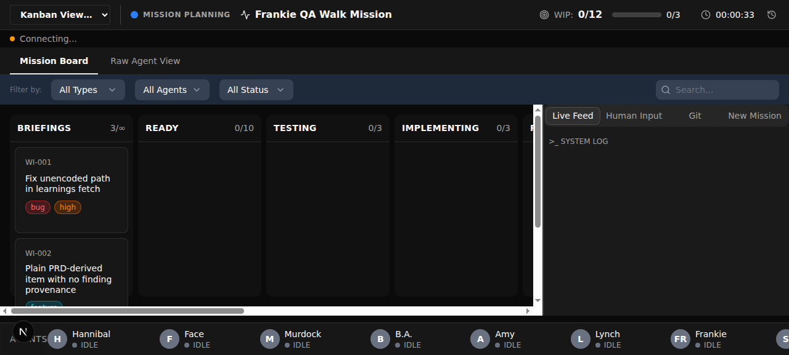
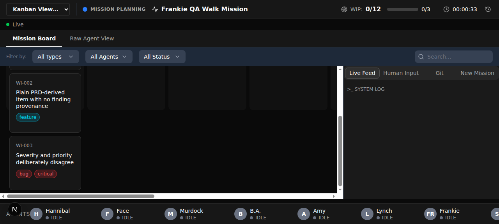
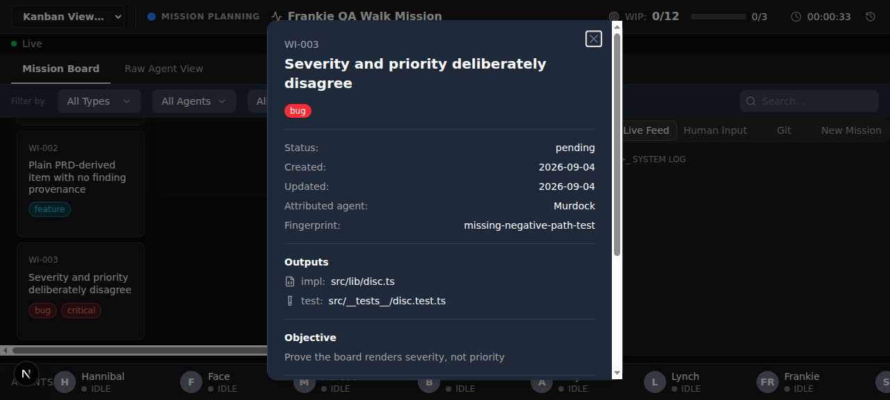
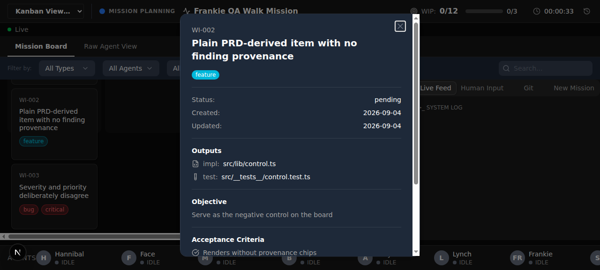
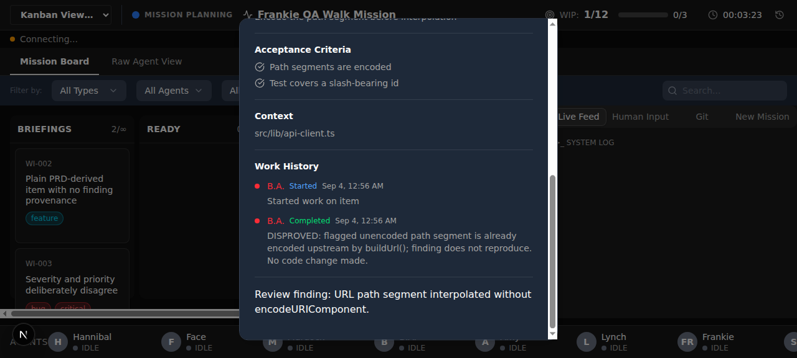

# Frankie's DoD Walk — M-20260903-002 (RE-WALK)

**Mission:** M-20260903-002 — Mission Entry Points & Quality Profiles
**PRD:** `prd/ready/mission-entry-points.md` (read complete, 161/161 lines — 15 DoD statements)
**Walked:** 2026-09-04
**Dev server:** `http://localhost:5567` (`devServer.managed: true` — started fresh by this walk, stopped after)
**Execution contract:** `surfaces: ["web"]`, `testing_level: critical-path`, `qa.seed: null`, `qa.drive: flowspec`, `evidence: screenshots`
**This is a re-walk.** A prior walk failed DoD 13 (WI-936). Every statement was re-walked from scratch, not just the one that failed.

---

## Verdict

**9 of 15 statements driven against the running app: 8 PASS, 1 PARTIAL. 0 FAIL.**
**6 of 15 statements NOT DRIVABLE in this environment — flagged as a dev-env gap, not as code failures.**

**No work item is bounced by this walk.** WI-936's fix is confirmed at the database level.

| # | Statement (abbreviated) | Result | How |
|---|---|---|---|
| 1 | `/ai-team:review` → one item per Must/Should Fix, Consider reported only | ⚠️ NOT DRIVABLE | contract inspected only |
| 2 | `/ai-team:review` with no findings → no mission | ⚠️ NOT DRIVABLE | contract inspected only |
| 3 | `/ai-team:bug-fix <issue#>` → mission with a `bug` item | ⚠️ NOT DRIVABLE | contract inspected only |
| 4 | `/ai-team:bug-fix` bad issue → reports why, no mission | ⚠️ NOT DRIVABLE | contract inspected only |
| 5 | `/ai-team:bug-fix "<description>"` → same shape, no GitHub | ⚠️ NOT DRIVABLE | contract inspected only |
| 6 | `/ai-team:bug-stomp` files defects; `--paths`/`--all`; clean hunt → no mission | ⚠️ NOT DRIVABLE | contract inspected only |
| 7 | Every entry point leaves a `prdPath` → readable brief with populated DoD | ✅ PASS | API — enforced at mission creation |
| 8 | `--quality deep` → full-dod + hands-on, no config edit | ✅ PASS | shipped resolver executed |
| 9 | Invalid `--quality` rejected naming all three, no mission | ✅ PASS | shipped resolver executed |
| 10 | `/ai-team:plan` surfaces recommendation; ratified profile stored before `ready` | ⚠️ PARTIAL | storage half driven; Sosa half not drivable |
| 11 | Pre-existing mission with no contract runs from `ateam.config.json` | ✅ PASS | shipped resolver executed |
| 12 | Board shows severity, attributed agent, fingerprint | ✅ PASS | browser walk |
| 13 | One learning per finding-derived item; re-run updates, not duplicates | ✅ PASS | API + direct DB read |
| 14 | Disproved finding → false-positive outcome naming the refuting work-log entry | ✅ PASS | API + direct DB read + browser |
| 15 | `/ai-team:sweep` prints a pointer and stops; no doc recommends it as live | ✅ PASS | artifact + repo-wide grep |

---

## Flagged: dev-env gaps (NOT code bugs — do not bounce a work item for these)

### GAP-1 — Entry-point commands have no end-to-end drive path (DoD 1–6)

Six of the fifteen DoD statements describe the behavior of Claude Code **slash commands**
(`/ai-team:review`, `/ai-team:bug-fix`, `/ai-team:bug-stomp`). They could not be driven, for two
independent reasons:

1. Frankie runs as a subagent and cannot invoke a Claude Code slash command.
2. Even a live operator could not run them right now. An entry point must refuse while a mission is
   active, and M-20260903-002 **is** active. I drove that guard directly and it works:

   ```
   POST /api/missions  (second mission, while one is active)
   → HTTP 409 {"code":"CONFLICT","message":"An active mission already exists. ..."}
   ```

   So the very guard that makes DoD 1–6 correct is what blocks them from being walked in-mission.

The command definitions in `commands/review.md`, `commands/bug-fix.md`, and `commands/bug-stomp.md`
were inspected and they do specify every behavior their DoD statement requires, precisely
(`review.md:44,67,111`; `bug-fix.md:19,20,55,65,69,115,116`; `bug-stomp.md:18,19,43,44,50,115`).
There are also unit tests over these files under `commands/__tests__/`.

**That is artifact inspection and unit tests, not a driven walk, and this report does not count it as
a pass.** Tests passing means nothing; only the driven walk counts. Verifying DoD 1–6 honestly needs a
harness that can invoke an entry point against a scratch project with no active mission — that harness
is a repo work item, not a change to this mission's feature code.

### GAP-2 — The QA seed has no items, so the drivable spine cannot be graduated

`ateam.config.json` declares `"qa": { "seed": null }`, and
`packages/kanban-viewer/prisma/seed.ts` creates a project and the nine stages but **zero work items**
(verified: the only rows in a fresh `qa.db` were the three this walk created by hand).

Consequence: the board finding-provenance flow — the drivable critical-path spine of this mission —
cannot be expressed as a repeatable FlowSpec file, because on a fresh `npm run dev:qa` it finds an
empty board and goes red for a purely environmental reason. Per Frankie's hard rules I did not
graduate a spec that would sit red for environmental reasons. See "Spec graduation" below.

---

## Flagged: minor defect (reported, not fixed)

### OBS-1 — `packages/shared/src/items.ts:12` points at the retired `commands/sweep.md`

```
 * Also matches the review-severity mapping in commands/sweep.md.
```

`commands/sweep.md` is now a 31-line tombstone containing **no** severity mapping. PRD FR-11 says the
mapping is "ported into the `/ai-team:review` command definition when sweep retires", and it was —
`commands/review.md:60–67` carries the real table. This comment is a stale pointer to content that no
longer exists there; a reader following it finds nothing.

This does **not** fail DoD 15, whose requirement is that no document still recommends `sweep` as a
*live command to run* — this comment cites it as a location, it does not recommend running it. Recorded
as an observation against **WI-944** (the sweep-retirement item) for the operator's discretion. The same
stale line is mirrored in the built `packages/shared/dist/items.js:8`.

---

## Statement-by-statement evidence

### ✅ DoD 7 — every mission carries a `prdPath` to a readable brief with a populated DoD

Driven at the single choke point every entry point must pass through — `POST /api/missions`:

```
POST /api/missions {"name":"No brief mission"}          → HTTP 400
  {"code":"VALIDATION_ERROR","message":"prdPath is required"}
```

The invariant is enforced by the API, so it holds for every entry point regardless of which one calls
it. The mission created for this walk stored `prdPath = prd/ready/mission-entry-points.md`, which is
readable and carries **15** populated `- [ ]` DoD statements.

### ✅ DoD 8 — `--quality deep` → full-dod + hands-on, with no config edit

Executed the **shipped** resolver (`scripts/hooks/lib/qa-contract.js`), not a re-implementation —
full transcript in [`quality-profile-drive.out`](quality-profile-drive.out), driver in
[`quality-profile-drive.mjs`](quality-profile-drive.mjs):

```
deep.testing_level === 'full-dod' : true
deep.review_tier   === 'hands-on' : true
deep carries probing_guidance     : true
quick  -> testing_level=smoke         review_tier=evidence-only
normal -> testing_level=critical-path review_tier=hands-on

ateam.config.json sha256[0:16] BEFORE : 33a015e0d13c0f43
ateam.config.json sha256[0:16] AFTER  : 33a015e0d13c0f43
config UNCHANGED by profile resolution : true
```

The before/after checksum is the "with no edit to `ateam.config.json`" half, proven rather than assumed.
A mission was also created carrying `{"profile":"deep","testing_level":"full-dod","review_tier":"hands-on"}`
and it round-tripped into the `Mission.executionContract` column.

### ✅ DoD 9 — an invalid `--quality` is rejected, naming all three

Four invalid values, all rejected, every message naming all three valid profiles:

```
"deeep"    : threw; names=[quick,normal,deep] all3=true
"DEEP"     : threw; names=[quick,normal,deep] all3=true
""         : threw; names=[quick,normal,deep] all3=true
"thorough" : threw; names=[quick,normal,deep] all3=true
   message: Unknown quality profile "deeep" — must be one of: quick, normal, deep
```

Note `"DEEP"` is rejected rather than case-folded to `deep` — correct against the PRD's
"never silently fall back."

### ⚠️ DoD 10 — PARTIAL

Two halves; only one has a runtime surface.

- **Driven — the profile is stored on the mission before any item reaches `ready`.** The mission record
  accepted and persisted `executionContract` at creation time, and a stored contract wins over config:
  `resolveExecutionContract({testing_level:'full-dod'}) → full-dod`, overriding the config's
  `critical-path`. Repo facts still come from config (`surfaces=["web"]`, `qa.drive=flowspec`), per FR-10.
- **Not driven — "surfaces a recommended profile in Sosa's refinement report at the existing gate."**
  That is planning-agent behavior reachable only through `/ai-team:plan`, and falls under GAP-1.

### ✅ DoD 11 — a mission with no stored contract behaves exactly as today

```
config                          testing_level=critical-path review_tier=hands-on
resolveExecutionContract(null)  testing_level=critical-path review_tier=hands-on
matches config exactly : true
```

### ✅ DoD 12 — the board surfaces severity, attributed agent, and fingerprint

Walked from the front door at `http://localhost:5567/?projectId=kanban-viewer`.

Three items were created through `POST /api/items` to make the assertion falsifiable:

| Item | priority | severity | purpose |
|---|---|---|---|
| WI-001 | high | high | ordinary finding-derived item |
| WI-002 | medium | *(none)* | negative control — no provenance at all |
| WI-003 | **low** | **critical** | discriminator — severity and priority deliberately disagree |



WI-003 is the load-bearing case: its card renders **`critical`** (its severity) and not `low` (its
priority), so a board that merely re-rendered `priority` would fail here instead of passing by
coincidence. The control WI-002 shows only its `feature` type chip and no severity chip.



Clicking through to the item detail modal surfaces the remaining two provenance fields — all three are
user-reachable from the front door:



```
Attributed agent:  Murdock
Fingerprint:       missing-negative-path-test
```

The control item's modal omits both rows entirely rather than rendering an empty or "unknown" value —
no invented provenance:



### ✅ DoD 13 — one learning per item; a re-run updates instead of duplicating

**This is the statement the previous walk failed (WI-936).** Full transcript:
[`dod13-14-db-verification.txt`](dod13-14-db-verification.txt).

`POST /api/learnings` exposes no `GET`, so persistence was verified by reading `qa.db` directly rather
than trusting the response body — the response echoing new content is exactly the trap that would hide
this bug.

Four captures were POSTed against the **same** `sourceItemId=WI-001`, each with different content:

```
1. 201 created  detail 'FIRST CAPTURE'   severity=high     fingerprint=unencoded-url-path-segment
2. 200 updated  detail 'SECOND CAPTURE'  severity=critical fingerprint=missing-encoding-test
3. 200 updated  detail 'THIRD CAPTURE'   severity=medium   fingerprint=unencoded-url-path-segment
4. 200 updated  false-positive outcome (see DoD 14)
```

Direct database read afterwards:

```
Row count for sourceItemId='WI-001' : 1      ← no duplicate
Total RetroLearning rows            : 2      ← exactly one per finding-derived item (WI-001, WI-003)
```

and the surviving row holds the **latest** capture's content — `detail`, `severity`,
`attributedAgent`, `targetSurface`, `title` and even a rewritten `fingerprint` all updated in place.
The second capture deliberately changed the fingerprint to `missing-encoding-test` to exercise the
fingerprint-rewrite path, and the row followed it.

A capture for a second item (WI-003) correctly inserted its **own** row (201) rather than folding into
the first — so "updates instead of duplicating" has not been over-applied into "one global row".

**WI-936's fix is confirmed: the re-capture persists new content, it does not return a stale row.**

### ✅ DoD 14 — a disproved finding carries an explicit false-positive outcome naming its refutation

A genuine refuting work-log entry was created through the agent lifecycle (not hand-written into the
DB), by claiming WI-001 and stopping with a disproving summary:

```
WorkLog id=2  agent=B.A.  action=completed
  summary: DISPROVED: flagged unencoded path segment is already encoded upstream by
           buildUrl(); finding does not reproduce. No code change made.
```

That entry is visible to a user in the item modal's Work History:



The derived learning then persisted, verbatim, in the database:

```
detail = outcome: false-positive. Refuted by work_log entry from agent B.A. with summary:
         "DISPROVED: flagged unencoded path segment is already encoded upstream by buildUrl();
         finding does not reproduce. No code change made." rejection_count=0.
```

It carries an explicit `outcome: false-positive` marker and names both the refuting agent and its
summary text, and the row was **updated in place** rather than dropped — satisfying "never silently
dropped".

**One structural note for Stockwell, not a failure:** `RetroLearning` has no dedicated `outcome`
column (columns are id, projectId, missionId, source, severity, attributedAgent, targetSurface,
pattern, fingerprint, title, detail, status, origin, createdAt, sourceItemId). The false-positive
outcome is carried as free text inside `detail`, which is what `agents/retro.md:135` and the route's
own comment specify. That matches the PRD's "keep the current `RetroLearning` contract" (§5 Out of
Scope), so it is in scope as designed — but it does mean the outcome is not machine-queryable, only
greppable.

### ✅ DoD 15 — `/ai-team:sweep` is a tombstone, and nothing recommends it as live

`commands/sweep.md` is 31 lines and does exactly what the statement requires: prints a pointer to
`/ai-team:review`, and stops. Its Behavior section is explicit — "It does not review the branch, does
not capture any findings, does not fix anything, and does not run `/ai-team:review` on your behalf" —
and the printed block ends in `STOP.` There is no forwarding.

Repo-wide grep for remaining `/ai-team:sweep` mentions, classified:

| Location | Live recommendation? |
|---|---|
| `commands/review.md`, `commands/bug-stomp.md` | No — comparative ("the replacement front door for…") |
| `CHANGELOG.md:68,69` | No — historical release record, correctly left unrewritten |
| `prd/**` | No — design documents, including this mission's own PRD |
| `playbooks/__tests__/`, `commands/__tests__/` | No — test files asserting the retirement |
| `packages/shared/src/items.ts:12` + `dist/items.js:8` | No — stale *location* pointer; see OBS-1 |

No agent prompt, playbook, skill, README, or CLAUDE.md still tells anyone to run it.

---

## Spec graduation

`testing_level: critical-path` → graduate the DoD's user-journey spine.

**Nothing was graduated this walk, deliberately.** The drivable spine of this mission is the board
finding-provenance flow (DoD 12). It passes by hand, but only against items created by hand: the QA seed
creates zero work items (GAP-2), so as a committed FlowSpec file it would go red on every fresh
`npm run dev:qa` for a purely environmental reason. Graduating a permanently-red spec trains the team to
ignore red, so the flow is parked, complete and ready, at
[`proposed-board-finding-provenance.flow.yaml`](proposed-board-finding-provenance.flow.yaml) with the
exact seed item needed to graduate it (a finding-derived item whose severity disagrees with its
priority — the disagreement is what makes the assertion meaningful).

`specs/staged-column.flow.yaml` was left untouched; graduated specs are add-only.

---

## Environment notes

- The dev server was started by this walk (`devServer.managed: true`) and stopped after it.
- `npm run dev:qa` deletes and re-migrates `prisma/data/qa.db`, then seeds it. Confirmed the running
  process served **`qa.db`** and not the prod-copy `ateam.db`, by reading the live process environment:
  `DATABASE_URL=file:/…/prisma/data/qa.db`, with no open file descriptor on `ateam.db`. This matters —
  `packages/kanban-viewer/.env` sets `DATABASE_URL="file:./data/ateam.db"`, so the inline override in
  `dev:qa` is the only thing keeping the walk off the production-copy database.
- All walk data (mission `M-20260904-001`, WI-001/002/003, 2 learning rows) lives in the disposable
  `qa.db`, which the next `dev:qa` run deletes.
