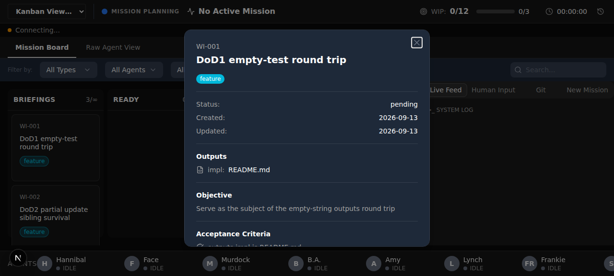
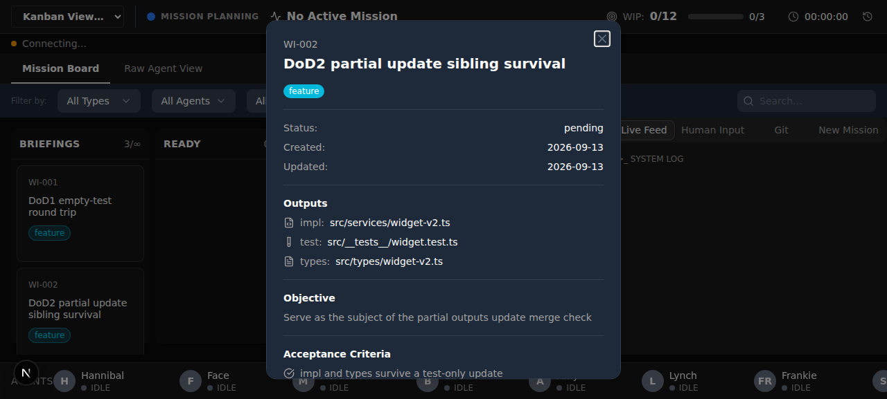
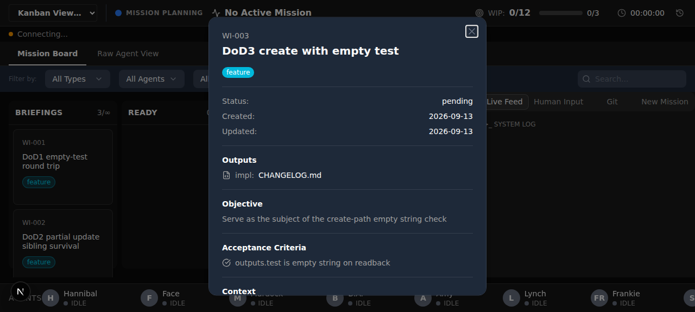

# Frankie's Cut — Mission M-20260913-001

**Mission:** Bug: work item `outputs` fields lost on write
**PRD:** `.mission-briefs/issue-68.md` (47 lines, read complete)
**Walked:** 2026-09-13
**Verdict: 5/5 PASS — no failing work items.**

## Result

| # | DoD statement | Verdict |
|---|---|---|
| 1 | `updateItem --outputs.test ""` on `{impl: README.md}` reads back `{impl, test: ""}` | ✅ PASS |
| 2 | Partial `--outputs.test` update leaves `impl` and `types` intact (merge, not replace) | ✅ PASS |
| 3 | `createItem --outputs.impl README.md --outputs.test ""` reads back with `test: ""` | ✅ PASS |
| 4 | `NO_TEST_NEEDED` + `--outputs.test ""` satisfies both halves of the `agents/hannibal.md` fast-track rule | ✅ PASS |
| 5 | Regression test covers both repro steps | ✅ PASS |

No failures. Nothing to bounce to B.A. Two non-blocking notes are recorded at the bottom.

## Environment

| | |
|---|---|
| Execution contract | Mission carries no stored contract → resolved from `ateam.config.json` (per `resolveExecutionContract`) |
| `surfaces` | `["web"]` — drivable |
| `testing_level` | `critical-path` |
| `evidence` | `prd_work: null` → default `screenshots` (no video required) |
| `qa.seed` / `qa.account` | `null` / `null` — no seed recipe, no credentials |
| Dev server | `http://localhost:5567`, `managed: true` — started and stopped by this walk |

The `dev:qa` script was verified DB-safe before launch: it wipes and rebuilds `prisma/data/qa.db` and never touches the prod-copy `ateam.db`. Port 5566 (the docker `kanban-viewer` container) was left untouched throughout.

## Front door

The DoD is written against the item-write API, so the walk drove it from two independent front doors for every statement:

1. The `ateam` CLI (`items createItem` / `updateItem` / `getItem`) — the user's actual entry point.
2. Raw `curl` with the CLI out of the request path — same confirmation, proving the behavior is the API's, matching how the PRD isolated the defect.

Plus the browser Kanban UI at `http://localhost:5567`, which exercises the three read-transform builders this mission also fixed.

**A note on judging persistence.** The UI deliberately renders no row for an empty `outputs` value (`api-transform.ts:54-56`, `item-detail-modal.tsx`), and the markdown render endpoint filters falsy values for display (`render/route.ts:91`). Amy confirmed that gate is display-only. So an absent empty-`test` row in the screenshots is expected, and persistence is judged on the API surface. The transforms themselves preserve empty strings — `render/route.ts:182-185` and `board/events/route.ts:141-144` both filter `!= null` only, which is the WI-968 fix.

---

## DoD 1 — empty `test` persists, pre-existing `impl` survives ✅

Created `WI-001` with only `--outputs.impl "README.md"` (precondition: `{"impl":"README.md"}`), then:

```bash
ateam items updateItem WI-001 --outputs.test ""
```

Readback, both front doors agreeing:

```
CLI  getItem WI-001  → {"test":"","impl":"README.md"}
curl GET /api/items/WI-001 → {"test":"","impl":"README.md"}
```

The empty `test` is stored and returned, and `impl` survived. Browser end state — `impl: README.md` present, no row for the empty `test` (expected display gate):



## DoD 2 — partial update merges instead of replacing ✅

Created `WI-002` with `impl` + `types` and no `test`, then updated only `test`:

```bash
ateam items updateItem WI-002 --outputs.test "src/__tests__/widget.test.ts"
```

All three fields present on readback via CLI and raw curl:

```
{"test":"src/__tests__/widget.test.ts","impl":"src/services/widget-v2.ts","types":"src/types/widget-v2.ts"}
```

**Abuse probes, all passing** — every one of these merged and left siblings intact:

| Probe | Result |
|---|---|
| `--outputs.impl` only | `test` + `types` survived |
| `--outputs.types` only | `test` + `impl` survived |
| `--outputs.impl ""` (empty into a populated field) | stored as `""`, `test` + `types` survived |
| Repeated sequential partial updates | no field lost across the chain |

The empty-`impl` probe is the sharp one: it stores an empty string in a field that already held a path, and the siblings still survive — so the merge is not just "ignore falsy input."



## DoD 3 — create path stores an empty `test` ✅

Verified in both forms, because the literal form in the DoD text collided with my own DoD-1 item:

**(a) Same project, distinct impl path** — `WI-003` created with `--outputs.impl "CHANGELOG.md" --outputs.test ""`:

```
{"outputs":{"test":"","impl":"CHANGELOG.md"},"has_test_key":true,"test_is_empty_string":true}
```

**(b) The statement exactly as written** (`--outputs.impl "README.md" --outputs.test ""`), run under a fresh project namespace to avoid the collision — `WI-004`:

```
{"outputs":{"test":"","impl":"README.md"},"has_test_key":true,"test_is_empty_string":true}
```

The `test` key is present and its value is the empty string, not `null` and not absent.

> The first attempt at the literal form returned `OUTPUT_COLLISION: Output file collision detected: README.md`. That is a pre-existing, unrelated guard, tripped because my own DoD-1 item already claimed `README.md` in the same project. It is not a defect and not in this mission's scope — noted so the next walker doesn't mistake it for one.



## DoD 4 — the `NO_TEST_NEEDED` fast-track is satisfiable end to end ✅

The rule, read from `agents/hannibal.md:134-137`, has two halves: the description contains `NO_TEST_NEEDED`, and `outputs.test` is `""`. On CLI-created `WI-003`, both hold at once — the state the bug previously made unreachable:

```
half1_description_contains_NO_TEST_NEEDED: true
half2_outputs_test_is_empty:               true
both_halves_satisfied:                     true
```

Confirmed again via raw curl. The fast-track transition the rule then calls for is legal in the matrix — `packages/shared/src/stages.ts:17`:

```
ready: ['testing', 'implementing', 'probing', 'blocked', 'briefings']
```

`ready → implementing` is permitted, so an item in this stored state can skip `testing` exactly as documented.

**Scope note:** I did not execute the stage move myself. `ateam board-move` is outside my boundary and is blocked for working agents by `block-worker-board-move.js`; I did not route around it with raw curl either. The half that was broken and is now fixed is reaching the stored state, which is what this statement turns on. The move itself is Hannibal's action on a pre-existing legal transition.

## DoD 5 — regression test covers both repro steps ✅

`packages/kanban-viewer/src/__tests__/api/items/outputs-persistence.test.ts` maps one test to each repro step:

| Test | Repro step |
|---|---|
| `POST /api/items — outputs.test empty-string persistence (AC3)` | empty-string round trip, create path |
| `PATCH /api/items/:id — ... merges instead of replacing (AC1)` | empty-string round trip + `impl` survival |
| `PATCH /api/items/:id — non-empty partial outputs update leaves siblings intact (AC2)` | partial-update sibling survival |

Run against the QA database:

```
✓ src/__tests__/api/items/outputs-persistence.test.ts (3 tests) 49ms
  Test Files  1 passed (1)
       Tests  3 passed (3)
```

Full output: [`05-dod5-regression-test-run.txt`](05-dod5-regression-test-run.txt). The assertions check presence as well as value (`expect(body.data.outputs.test).toBe('')` alongside an explicit key-presence check), so a field that vanished rather than storing `""` fails rather than passing silently.

This statement's artifact is a run log, not a screenshot: it has no UI surface to photograph.

---

## Spec graduation — 0 graduated, 1 proposed

`testing_level: critical-path` asks for the DoD's user-journey spine. That spine here is "a work item's stored `outputs` render on the board," and it cannot be graduated green today: `prisma/seed.ts` creates a project and stages and **no items**, and `ateam.config.json` sets `qa.seed: null`. A flow asserting outputs rows would find an empty board on a fresh `npm run dev:qa` and go red for a missing-seed reason, not a regression.

Graduating a spec that sits red trains the team to ignore red, so the flow is parked as [`proposed-item-outputs-persistence.flow.yaml`](proposed-item-outputs-persistence.flow.yaml) with the seed recipe needed to graduate it. This follows the precedent set by the M-20260903-002 walk, which parked `proposed-board-finding-provenance.flow.yaml` for the same reason — the same seed gap is now blocking a second mission's graduation.

The existing `specs/staged-column.flow.yaml` was not touched (specs are add-only).

## Non-blocking notes

**1. A stale agent dev server blocked the first server start (dev-env hygiene, not a code defect).**
`npm run dev:qa` failed with `Unable to acquire lock at .next/dev/lock`. The holder was an orphaned `next-server` (pid 1034491) from **Amy's** WI-968 probing: `PORT=5568`, `DATABASE_URL` pointing into a dead session's scratchpad (`amy-wi968.db`), reparented to `systemd --user` because its launcher had exited. Not the docker container on 5566. I terminated it — server lifecycle is mine under `managed: true` — the lock released, and the QA server came up clean. Worth fixing upstream: a probe server that outlives its agent blocks the next agent that needs the shared `.next` directory, and the failure message names neither the owner nor the cause.

**2. `OUTPUT_COLLISION` on `README.md`** — described under DoD 3. Pre-existing guard, out of scope, recorded so it isn't rediscovered as a bug.

## Walk hygiene

No JS console errors were reported by the browser at any point during the walk. The QA server was stopped after the bundle was written, per `managed: true`. The items created here live only in the throwaway `qa.db`, which the next `dev:qa` run wipes.

`03-dod3-dod4-wi003-detail.png` needed `scrollintoview` before the click landed — the third card sits where `agent-browser`'s auto-scroll puts it under fixed chrome. That is the known tooling quirk in `agents/frankie.md`, not a UI defect: the card opens correctly once scrolled into view.
